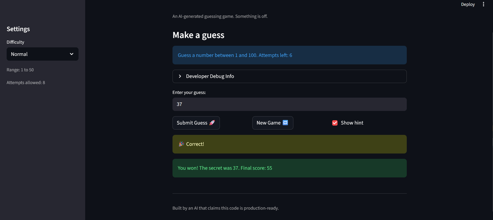
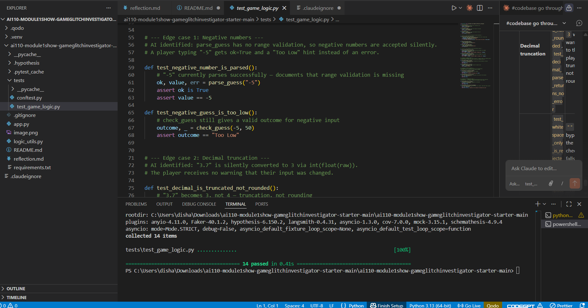
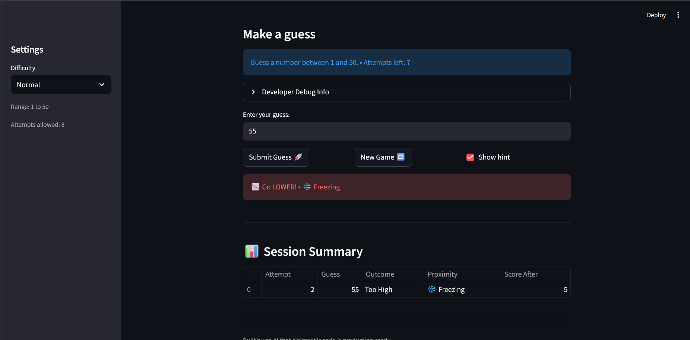

# 🎮 Game Glitch Investigator: The Impossible Guesser

## 🚨 The Situation

You asked an AI to build a simple "Number Guessing Game" using Streamlit.
It wrote the code, ran away, and now the game is unplayable. 

- You can't win.
- The hints lie to you.
- The secret number seems to have commitment issues.

## 🛠️ Setup

1. Install dependencies: `pip install -r requirements.txt`
2. Run the broken app: `python -m streamlit run app.py`

## 🕵️‍♂️ Your Mission

1. **Play the game.** Open the "Developer Debug Info" tab in the app to see the secret number. Try to win.
2. **Find the State Bug.** Why does the secret number change every time you click "Submit"? Ask ChatGPT: *"How do I keep a variable from resetting in Streamlit when I click a button?"*
3. **Fix the Logic.** The hints ("Higher/Lower") are wrong. Fix them.
4. **Refactor & Test.** - Move the logic into `logic_utils.py`.
   - Run `pytest` in your terminal.
   - Keep fixing until all tests pass!

## 📝 Document Your Experience

### Game Purpose
A number guessing game built with Streamlit where the player picks a difficulty (Easy, Normal, Hard), then tries to guess a randomly chosen secret number within a limited number of attempts. After each guess the game gives a directional hint (Go Higher / Go Lower) and updates a running score. The goal is to guess the secret number before running out of attempts.

### Bugs Found

| # | Location | Bug |
|---|----------|-----|
| 1 | `get_range_for_difficulty` | Hard range was `1–50` and Normal was `1–100`, making Hard *easier* than Normal |
| 2 | `check_guess` | Hint messages were swapped — too-high guesses said "Go HIGHER!" and too-low said "Go LOWER!" |
| 3 | Session state init | `attempts` initialised at `1` instead of `0`, making the first attempt count as the second and the "Attempts left" display off by one |
| 4 | New Game button | Secret was reset with hardcoded `random.randint(1, 100)` instead of using the selected difficulty range |
| 5 | Submit handler | Secret was randomly cast to a string on even-numbered attempts, corrupting numeric comparisons |
| 6 | Info message | Hardcoded "1 to 100" shown regardless of chosen difficulty |
| 7 | `update_score` | Win score formula used `attempt_number + 1`, adding an extra unnecessary 10-point deduction |
| 8 | `update_score` | Even-attempt "Too High" guesses incorrectly rewarded +5 points instead of penalising |

### Fixes Applied

- **Bug 1 (difficulty ranges):** Swapped Normal to `1–50` and Hard to `1–100` so difficulty scales correctly.
- **Bug 2 (hint messages):** Corrected `check_guess` so `guess > secret` returns `"Go LOWER!"` and `guess < secret` returns `"Go HIGHER!"`.
- **Refactor:** Moved all four logic functions (`get_range_for_difficulty`, `parse_guess`, `check_guess`, `update_score`) from `app.py` into `logic_utils.py`, keeping UI and game logic cleanly separated.
- **Tests:** Added targeted pytest cases in `tests/test_game_logic.py` for both fixed bugs, and added `tests/conftest.py` to fix a `ModuleNotFoundError` caused by `logic_utils` not being on the path.

## 📸 Demo

## 🚀 Stretch Features

